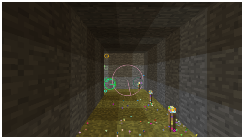
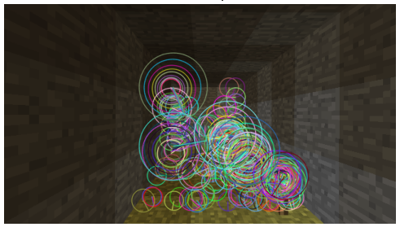
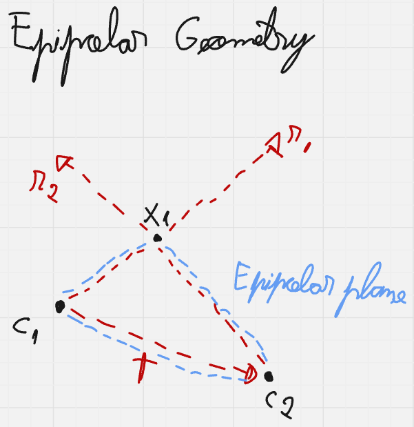
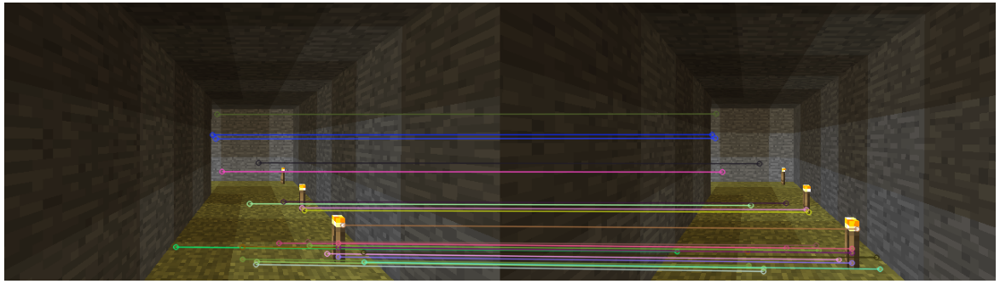
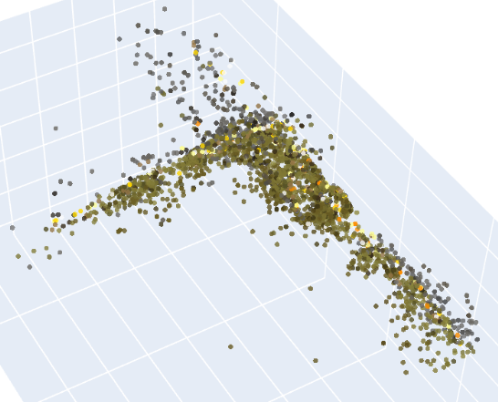

# Structure from Motion Pipeline

Structure from Motion (SfM) is a technique for estimating three-dimensional structures from two-dimensional image sequences. In a traditional SfM pipeline, both the camera parameters (extrinsics) and the scene geometry (3D points) are unknown and must be estimated simultaneously. In this specific implementation, we simplify the problem a bit and operate under a definition often referred to as mapping with known poses. We utilize a synthetic Minecraft dataset generated via [Project Malmo](https://github.com/microsoft/malmo), which provides ground-truth poses for the camera. Consequently, our pipeline bypasses the "motion" estimation phase and focuses on the "structure" aspect: triangulation of features based on known projection matricesThe Pipeline Goal

- Ingest a sequence of RGB images and their corresponding pose tuple ($X, Y, Z, \text{yaw}, \text{pitch}$).

- Convert them into camera matrices, a mathematically rigorous linear algebra framework.

- Detect and track features across multiple views.

- Triangulate these features into a 3D point cloud.

- Refine the structure via bundle adjustment to minimize reprojection error and get to a less noisy point-cloud.

## Camera Matrices

Because our data originates from a game engine (Minecraft) and is processed in a computer vision library ([OpenCV](https://opencv.org/)), we must define a rigorous transformation between these two worlds.

### Dataset and Input Space 
Our dataset provides the classic rigid body 6-DoF pose of the agent (camera) for every frame $i$, though our specific input data is constrained to 5-DoF  because roll is always 0:

- Position of the camera in world coordinates: $\boldsymbol{C}_w = [X, Y, Z]^T$.

- Orientation fo the camera in world frame: Euler angles $\theta_{yaw}$ and $\phi_{pitch}$ in degrees (there's no roll in Minecraft).

And from the game information, we know that the Minecraft world frame ($\mathcal{F}_W$) is: 

- $+\boldsymbol{X}_W$: East.

- $+\boldsymbol{Y}_W$: Up.

- $+\boldsymbol{Z}_W$: South.

- Yaw: $0^\circ \rightarrow +Z_W$ and $-90^\circ \rightarrow +X_W$.

- Pitch: $-90^\circ \rightarrow +Y_W$ and $+90^\circ \rightarrow -Y_W$.

We should also consider the camera frame ($\mathcal{F}_C$):

- $+\boldsymbol{X}_C$: Pointing right.

- $+\boldsymbol{Y}_C$: Pointing down.

- $+\boldsymbol{Z}_C$: Pointing forward (the optical axis).

     
    

    Illustration of world and camera frames for better understanding.
     

### Target Space: Pinhole Camera Model

We utilize the standard Pinhole Camera Model. This requires us to construct a projection matrix $\boldsymbol{P}$ that maps a 3D point in the world $\boldsymbol{X}_w$ to a 2D pixel coordinate $\boldsymbol{x}$. Mathematically:

$$\boldsymbol{x} \approx \boldsymbol{P} \boldsymbol{X}_w$$
$$\boldsymbol{P} = \boldsymbol{K} [\boldsymbol{R} | \boldsymbol{t}]$$

Where:

- $\boldsymbol{K}$ is the intrinsics matrix (internal camera properties).

- $\boldsymbol{R}$ is the rotation matrix (mapping world axes to camera axes).

- $\boldsymbol{t}$ is the translation vector (position of the world origin relative to the camera).

#### Intrinsics K

Now we have to construct all of these mathematical objects, starting with the intrinsics. It projects 3D camera coordinates onto the 2D image plane and, assuming we have no skew, it's given by:

$$\boldsymbol{K} =
\begin{bmatrix} 
    f_x & 0 & c_x \\
    0 & f_y & c_y \\
    0 & 0 & 1
\end{bmatrix}$$

Given an image resolution $W \times H$ and a horizontal field of View ($FoV_h$), selected by the player inside the the game, the horizontal focal length $f_x$ is derived as:

$$f_x = \frac{W}{2 \cdot \tan(FoV_h / 2)}$$

     
    

    Illustration of pinhole camera model to make computations clearer.
      

A point that of common struggle is understanding the meaning of $f_x$ and $f_y$, after all $f$ is just a distance along the Z-axis, so it shouldn't have an horizontal and vertical components. These numbers encode, in reality, the same distance $f$, only measured with pixel width units for $f_x$ and pixel height units for $f_y$. This also explains the next fact we are going to use: by design, Minecraft has square pixels, which implies that our pixel units are the same, thus $f_y = f_x$. Additionaly, by the fact that this is a simulation, we also have a centralized principal point, which means:

$$c_x = \frac{W}{2}, \quad c_y = \frac{H}{2}$$

#### Rotation Matrix R

So we now know how to compute intrinsics perfectly, we can start constructing extrinsics. We cannot simply convert Minecraft Euler angles to a rotation matrix directly because of the zero mismatch. Standard Euler matrices assumes that, at angle 0, the object is perfectly aligned with the world, which is not the case of our camera (check the world and camera frames image again).

Instead, we construct the rotation matrix $\boldsymbol{R}$ column-by-column (or row-by-row) by calculating the Basis Vectors of the camera frame expressed in world coordinates. For that, we'll make use of spherical coordinates using Minecraft definitions of yaw and pitchThe forward vector ($\boldsymbol{f}$) corresponds to the camera's Z-axis ($+\boldsymbol{Z}_C$):

$$f_x = - \cos(\phi_{pitch}) \sin(\theta_{yaw})$$

$$f_y = -\sin(\phi_{pitch})$$

$$f_z = \cos(\phi_{pitch}) \cos(\theta_{yaw})$$

Note that the signs had to be adjusted for sines in $X$ and $Y$ coordinates because of yaw and pitch rotation conventions from Minecraft. This will eventually be the case for the next vector too.

The right vector ($\boldsymbol{r}$) corresponds to the camera's X-axis ($+\boldsymbol{X}_C$):

$$r_x = -\cos(\theta_{yaw})$$

$$r_y = 0$$

$$r_z = -\sin(\theta_{yaw})$$

- The down vector ($\boldsymbol{d}$) corresponds to the Camera's Y-axis ($+\boldsymbol{Y}_C$). Since our basis vectors must be orthogonal, the down vector is simply the cross product of the previous vectors. Choosing the order depends on where we want it to point at and, in our case, the answer is down ($-\boldsymbol{Y}_W$), so we use forward then right:

$$\boldsymbol{d} = \boldsymbol{f} \times \boldsymbol{r}$$

This comes from [OpenCV](https://opencv.org/), where $\boldsymbol{X} \times \boldsymbol{Z} = -\boldsymbol{Y}$ (with $+\boldsymbol{Y}$ pointing down by convention), so we do the opposite order.

     
    

    Geometric illustration of the camera Z vector getting computed in terms of the world frame to clarify how to get to the above expressions.
      

     
    

    Geometric illustration of the camera X vector getting computed in terms of the world frame to clarify how to get to the above expressions.
      

Now we can get back to the rotation matrix, which rotates a vector from world frame to camera frame. Rows are simply these normalized and transposed (because the matrix will be left multiplying) basis vectors. Since we want the typical $(X, Y, Z)$ coordinates, we'll stack the matrix with $\boldsymbol{r}$ then $\boldsymbol{d}$ then $\boldsymbol{f}$:

$$\boldsymbol{R} =
\begin{bmatrix}
\rule[2pt]{10pt}{0.5pt} & \boldsymbol{r}^T & \rule[2pt]{10pt}{0.5pt} \\
\rule[2pt]{10pt}{0.5pt} & \boldsymbol{d}^T & \rule[2pt]{10pt}{0.5pt} \\
\rule[2pt]{10pt}{0.5pt} & \boldsymbol{f}^T & \rule[2pt]{10pt}{0.5pt} 
\end{bmatrix}$$

#### Translation Vector t

And finally getting to the translation vector $\boldsymbol{t}$, it represents the position of the world origin as seen from the camera frame. Intuitively it's what makes the camera the origin of its own frame. To compute it, we do:
 
$$\boldsymbol{R} \cdot \boldsymbol{C}_w + \boldsymbol{t} = \boldsymbol{0} \implies$$

$$\implies \boldsymbol{t} = -\boldsymbol{R} \cdot \boldsymbol{C}_w$$

## Feature Extraction and Matching

Now that we know how to map points in the world to pixels in our images, we move on to the next part: feature extraction and tracking. This chapter documents how we identify specific points in the 3D world from the 2D images (feature extraction) and how we determine that a point in image A is the same physical object as a point in image B (matching and tracking).

We implemented our code with two possible (open-source) feature extractors so we could compare methods. We now introduce them here:

### Scale-Invariant Feature Transform (SIFT)

To reconstruct the 3D structure, we first need to identify "interesting" points in our 2D images that are invariant to scale, rotation, and illumination changes. We utilize the SIFT.

For an image $I$, SIFT identifies keypoints $\boldsymbol{x} = (u, v)$ and computes a descriptor vector $\boldsymbol{d} \in \mathbb{R}^{128}$ for each. These are the multiple steps to get there:

- Scale-Space Construction: The image is convolved with Gaussian filters at different scales to get different zoom perceptions of the image. Then Differences of Gaussians (DoG) are computed to find potential keypoints that are stable across different zoom levels.

- Keypoint Localization: Low-contrast points and edge responses are eliminated to leave only strong "corner-like" features. The former are easy to identify (simply extrema detection), but the latter are a bit more tricky.

    First, a DoG function responds strongly to corners and edges, so why do we remove edges? Edges are bad for tracking because of the aperture problem. Check [this very cool website](https://elvers.us/perception/aperture/) for more details, but basically it states that the local motion information is inherently ambiguous with respect to the global motion for a straight line seen through a small aperture. That is, many different motions could cause the same response visual response for a small receptive field.

    So back to removing edges, SIFT calculates the Hessian matrix $\boldsymbol{H}$ at the keypoint location. We then check the ratio of eigenvalues of $\boldsymbol{H}$. If the ratio is high (one eigenvalue is much bigger than the other), it indicates an edge and we can discard these keypoints. We only keep points where curvature is high (two big and relatively similar eigenvalues) in both directions, which indicates a corner.
    
$$\boldsymbol{H} = \begin{bmatrix}
D_{xx} & D_{xy} \\
D_{xy} & D_{yy} \\
\end{bmatrix}$$

- Orientation Assignment: To make the descriptor rotation-invariant, we must assign a dominant direction to the keypoint so we can rotate the world to match it later.

    For that, we take a window around the keypoint depending on the scale $\sigma$. We then compute the gradient magnitude $m(x,y)$ and orientation $\theta(x,y)$ for every pixel in that window and we build a 36-bin histogram (covering 360 degrees in 10 degrees steps). Pixels closer to the center matter more, so we weight the magnitude contributions by a Gaussian window.
    
    Sometimes a corner is ambiguous, so if the histogram has a secondary (ore more) peak that is within 80% of the main peak's height, SIFT creates two separate keypoints at the exact same location $(x,y)$, but with different orientations. This allows the algorithm to try matching both versions. To visualize this scenario, think of a dot on a black background. The gradients would point outward in all directions and we would probably get a very flat histogram.

- Keypoint Descriptor: A $16 \times 16$ neighborhood around the keypoint is taken. It is divided into $16$ sub-blocks of $4 \times 4$ size. For each sub-block, an 8-bin orientation histogram is created, which leads to a $4 \times 4 \times 8 = 128$ element feature vector.This vector $\boldsymbol{d}$ is the "fingerprint" of that visual feature.

    Notice that there's a difference between the general orientation and the descriptor. The keypoint orientation is the reference frame whereas the descriptor bins are the data. Suppose you didn't do the former. If you took a photo a same intersection for which you already computed SIFT features while hanging upside down, the descriptor would change (also be upside down), and we wouldn't match keypoints that were supposed to be matches.

     
    

    Illustration of SIFT feature extractor on one of our experiments.
      

Given two images $I_a$ and $I_b$, we seek to find corresponding keypoints. We use a K-Nearest Neighbors (k-NN) approach with the Euclidean distance metric ($L_2$ norm). For a descriptor $\boldsymbol{d}_{a}$ in image A, we find the two closest descriptors $\boldsymbol{d}_{b1}, \boldsymbol{d}_{b2}$ in image B. Then we use Lowe's Ratio Test to reject ambiguous matches: only accept a match if the closest neighbor is significantly closer than the second closest. The concept of significantly closer depends on a chosen trehshold $\alpha$, but the general forumaltion is given by:

$$||\boldsymbol{d}_a - \boldsymbol{d}_{b1}|| < \alpha ||\boldsymbol{d}_a - \boldsymbol{d}_{b2}||$$

### Oriented FAST and Rotated BRIEF (ORB)

ORB is designed to be a faster, binary alternative to SIFT.

- FAST Detector: It looks at a ring of 16 pixels around a candidate center $p$. If $N$ contiguous pixels are all brighter (or all darker) than $p$ by a threshold $t$, it is a corner. This is fast because it uses simple comparisons, not derivatives.

- Orientation: FAST does not have a natural orientation. ORB adds this by computing the intensity centroid. It calculates the "center of mass" of pixel intensity in a patch. The vector from the geometric center $(0,0)$ to the intensity centroid defines the orientation angle $\theta$.

- BRIEF Descriptor: Unlike SIFT (which stores direction histograms), BRIEF stores bits. It selects 256 random pairs of pixels $(p_1, p_2)$ in the patch. If intensity($p_1$) < intensity($p_2$), write 1, else, write 0. Notice that these 256 pairs are going to be the same across all patches and images, to make sure we can compare them properly later on.

- Rotation: Standard BRIEF is not rotation invariant. ORB uses the angle $\theta$ found by oriented FAST to steer the 256 test pairs. If the pair was originally pixel (10, 0) vs pixel (0, 10), and the orientation is $90^\circ$, we rotate those coordinates by $90^\circ$ before sampling the pixels. Just for completeness, for the previously mentioned pair and rotation, we would get a pixel coordinates (0, 10) and (-10, 0).

     
    

    Illustration of ORB feature extractor on one of our experiments.
      

For matching, we apply the exact same Lowe's ratio test, but now the descriptor is a string of 1s and 0s, so we measure distances using Hamming (XOR operation), which is much faster for CPUs than SIFT's Euclidean distance.

### Issues Working with Minecraft

While robust in the real world because they were designed for natural images, these descriptors face various challenges in a voxel environment like ours: 

- Texture Repetition: This is the biggest killer. In Minecraft, a dirt block at location A uses the exact same texture file as a dirt block at location B. To SIFT/ORB, these patches look mathematically identical.

- Lack of Scale Variance: Minecraft textures are low-resolution pixel art. When viewed from far away, the high-frequency pixel patterns create [Moiré patterns](https://michaelbach.de/ot/lum-moire1/). A slight camera movement changes the pixel values drastically, altering the gradients SIFT relies on.

Because of that, we had to chose an atypically small $\alpha = 0.55$ to guarantee some kind of proper matching between features, although it highly reduced the amount of matches we ended up with for pairs of images.

### Filtering Matches

The matches produced by the k-NN algorithm are hypothetical. While they look similar in appearance, they may be geometrically impossible (like a pixel on the floor matched to a pixel on the ceiling).

To filter these outliers, we impose a rigid geometric constraint: epipolar geometry. Consider a single 3D point $\boldsymbol{X}_1$ observed by two cameras with centers $\boldsymbol{C}_1$ and $\boldsymbol{C}_2$ (for simplicity, we treat camera 1 as the center of the universe, so the 3D point $\boldsymbol{X}_1$ is $\boldsymbol{X}_w$). These three points form a triangle in 3D space. This triangle lies on a specific 2D plane called the epipolar plane. This coplanarity allows us to derive a strict algebraic relationship between the projection of the point in image 1 and image 2.

     
    

    Illustration of the epipolar geometry and epipolar plane.
      

Now let $\boldsymbol{x}_1$ and $\boldsymbol{x}_2$ be the coordinates of the feature points in **normalized** camera coordinates. We obtain these by removing the camera intrinsics from pixel coordinates:

$$\boldsymbol{x}_{norm} = \boldsymbol{K}^{-1} \boldsymbol{x}_{pixel}$$

It's very important to notice here that $\boldsymbol{x}_{norm}$ is not exactly a point in space. When doing the forward math from $\boldsymbol{X}_c = [X, Y, Z]^T$ to $\boldsymbol{u} = [u, v, 1]^T$, we have:

$$\boldsymbol{K} \begin{bmatrix} 
X \\ 
Y \\ 
Z
\end{bmatrix} = \begin{bmatrix} 
u = f_x X + c_x Z \\ 
v = f_y Y + c_y Z \\ 
Z 
\end{bmatrix} = \lambda \begin{bmatrix} 
u \\ 
v \\ 
1 
\end{bmatrix}$$

With $\lambda = Z$ encoding the depth information because we have to divide the first two coordinates by it to get to the pixel coordinate. But when doing the back computation, starting from a pixel, we don't have $\lambda$, so we end up with the ratio of the $X$ and $Y$ coordinates with respect to $Z$, but not an actual point in 3D space:

$$\boldsymbol{K}^{-1} \begin{bmatrix}
u \\
v \\ 
1 
\end{bmatrix} = \begin{bmatrix} 
(u - c_x)/f_x \\ 
(v - c_y)/f_y \\ 
1 
\end{bmatrix} = \begin{bmatrix} 
X / Z \\ 
Y / Z \\ 
1 
\end{bmatrix}$$

So mathematically, $\boldsymbol{K}^{-1} \boldsymbol{x}_{pixel}$ gives us the coordinates of the point if the depth was exactly $Z=1$. Since the depth could be anything, this vector represents an infinite line passing through $(0,0,0)$ and $(X/Z, Y/Z, 1)$, which is a ray.

The relationship between the two camera views is defined by a rotation $\boldsymbol{R}$ and translation $\boldsymbol{t}$, so a point in the second frame is related to the first frame by rigid body motion:

$$\boldsymbol{x}_2 = \boldsymbol{R} \boldsymbol{x}_1 + \boldsymbol{t}$$

Note that this holds up to a scale factor since we don't know depth yet, but the vectors point in the same direction. Mathematically, the relationship that involves the true 3D depths is:

$$\lambda_2 \boldsymbol{x}_2 = \boldsymbol{R} (\lambda_1 \boldsymbol{x}_1) + \boldsymbol{t}$$

And now hold on to your chairs because we are going to do some algebraic massage to this equation until we can eliminate the depth variables we don't know:

$$\lambda_2 \boldsymbol{x}_2 = \lambda_1 \boldsymbol{R} \boldsymbol{x}_1 + \boldsymbol{t} \underset{\text{Cross product with } \boldsymbol{t}} \implies$$

$$\implies \boldsymbol{t} \times (\lambda_2 \boldsymbol{x}_2) = \boldsymbol{t} \times (\lambda_1 \boldsymbol{R} \boldsymbol{x}_1 + \boldsymbol{t}) \implies$$

$$\implies \lambda_2 (\boldsymbol{t} \times \boldsymbol{x}_2) = \lambda_1 (\boldsymbol{t} \times \boldsymbol{R} \boldsymbol{x}_1) \underset{\text{Dot product with } \boldsymbol{x}_2} \implies$$

$$\implies \boldsymbol{x}_2 \cdot [ \lambda_2 (\boldsymbol{t} \times \boldsymbol{x}_2) ] = \boldsymbol{x}_2 \cdot [ \lambda_1 (\boldsymbol{t} \times \boldsymbol{R} \boldsymbol{x}_1) ] \implies$$

$$\implies 0 = \lambda_1 [ \boldsymbol{x}_2 \cdot (\boldsymbol{t} \times \boldsymbol{R} \boldsymbol{x}_1) ] \underset{\lambda_1 \text{ cannot be 0 (inside the camera)}} \implies$$

$$\implies \boldsymbol{x}_2 \cdot (\boldsymbol{t} \times \boldsymbol{R} \boldsymbol{x}_1) = 0$$

This last equation we just got to is a rewriting of the famous essential matrix equation. We'll use a cross-product simulating matrix and the associative property of matrix multiplication to get:

$$\boldsymbol{x}_2 \cdot (\boldsymbol{t} \times \boldsymbol{R} \boldsymbol{x}_1) = \boldsymbol{x}_2 \cdot ([\boldsymbol{t}]_\times (\boldsymbol{R} \boldsymbol{x}_1)) =$$

$$= \boldsymbol{x}_2 \cdot (([\boldsymbol{t}]_\times \boldsymbol{R}) \boldsymbol{x}_1) = \boldsymbol{x}_2^T ([\boldsymbol{t}]_\times \boldsymbol{R}) \boldsymbol{x}_1 =$$

$$= \boldsymbol{x}_2^T \boldsymbol{E} \boldsymbol{x}_1 = 0$$

Where

$$[\boldsymbol{t}]_\times = \begin{bmatrix} 
0 & -t_3 & t_2 \\
t_3 & 0 & -t_1 \\
-t_2 & t_1 & 0
\end{bmatrix}$$

Finally getting to the part where we filter points, we start by solving for $\boldsymbol{E}$. We could do it using all our matches via least squares, but a single outlier would ruin the result. Instead, we use Random Sample Consensus (RANSAC):

- Randomly select the minimum number of points required to solve for $\boldsymbol{E}$. Since $\boldsymbol{E}$ has 5 degrees of freedom (3 rotation, 2 translation), we select 5 random matches. Just to ratify why we only have 2 degrees of freedom for translation, remember that scale is unknown. This basically means that if we move the camera 2 center along the ray it shoots on $\boldsymbol{X}_1$, it won't change $\boldsymbol{x}_2$, which puts a constraint on the translation vector, reducing one degree of freedom from it.

- Compute a candidate essential matrix $\boldsymbol{E}_{cand}$ using the [Nister 5-point algorithm](https://www-users.cse.umn.edu/~hspark/CSci5980/nister.pdf). Test all other matches against this candidate. For each match $(\boldsymbol{x}_1, \boldsymbol{x}_2)$, we calculate the error: how far is point $\boldsymbol{x}_2$ from the epipolar line defined by $\boldsymbol{E}_{cand} \boldsymbol{x}_1$? If distance is less than a threshold (normally 1 or less), count it as an inlier.

- Repeat the previous steps $N$ iterations and keep the $\boldsymbol{E}$ that produced the highest number of inliers. Then re-calculate the final $\boldsymbol{E}$ using only those inliers for maximum precision. The result is a boolean mask. Matches that fit the geometric model (inliers) are kept for triangulation. Matches that violate the geometry (outliers) are discarded.

     
    

    Illustration of matching result using SIFT features after matching and filtering on one of our experiments. It's visible that we end up with only very reasonable matches, even though some keypoints are not that really distinctive for the scene.
      

### Tracking

A critical architectural decision in our pipeline that had positive impact on the final reconstruction was the move from pairwise matches to global tracks (for later multi-view triangulation). Standard pairwise triangulation treats the pair $(I_1, I_2)$ and $(I_2, I_3)$ as separate universes. If a feature exists in all three frames, naive pairwise logic creates two separate 3D points ($X_{12}$ and $X_{23}$) for the same physical object. This results in ghosting or noise in the final point cloud.

We solve this by building a track list, propagating features across consecutive frames until it's not found anymore. This results in a set of tracks, where a single track $\mathcal{T}$ represents one physical 3D point observed across $N$ consecutive frames:

$$\mathcal{T}_k = \{ (I_{start}, u, v), (I_{start+1}, u', v'), \dots, (I_{end}, u'', v'') \}$$

Although this is far from what modern tracking can do (and what we'll try to explore on other pipelines), it's a simple and fast implementation that already gave us promising results.

## Triangulation and 3D Reconstruction

Once we have a set of matched feature points across $N$ images and the corresponding projection matrices $\boldsymbol{P}_i$, our goal is to estimate the 3D structure. For a single 3D point $\boldsymbol{X}_w = [X, Y, Z, 1]^T$ observed in an image as pixel $\boldsymbol{x} = [u, v, 1]^T$, the projection equation is:

$$\lambda \boldsymbol{x} = \boldsymbol{P} \boldsymbol{X}_w$$

Where $\lambda$ is the unknown projective depth. We have unknowns on both sides of the equation ($\boldsymbol{X}_w$ and $\lambda$). We cannot simply invert $\boldsymbol{P}$ because it is a $3 \times 4$ matrix (non-invertible, which makes sense because projection destroys depth). We need a method to solve for $\boldsymbol{X}_w$ linearly, that's when we employ the Direct Linear Transform (DLT).

### DLT Algorithm

The fundamental insight of DLT is that the vectors on the left side ($\lambda \boldsymbol{x}$) and the right side ($\boldsymbol{P} \boldsymbol{X}_w$) are equal, so they point in the exact same direction. If two vectors are collinear, their cross product is zero.

$$\lambda \boldsymbol{x} \times (\boldsymbol{P} \boldsymbol{X}_w) = \boldsymbol{0} \implies \boldsymbol{x} \times (\boldsymbol{P} \boldsymbol{X}_w) = \boldsymbol{0}$$

We eliminate the scalar $\lambda$ to get to a linear system and to make the system solvable with 2 views (if we kept $\lambda$'s we would need at least 3 views to solve). Now let $\boldsymbol{P}$ be represented by its row vectors $\boldsymbol{p}^1, \boldsymbol{p}^2, \boldsymbol{p}^3$.

$$\boldsymbol{P} \boldsymbol{X}_w = \begin{bmatrix} 
\boldsymbol{p}^1 \boldsymbol{X}_w \\ 
\boldsymbol{p}^2 \boldsymbol{X}_w \\ 
\boldsymbol{p}^3 \boldsymbol{X}_w 
\end{bmatrix}$$

Writing out the cross product $\boldsymbol{x} \times (\boldsymbol{P} \boldsymbol{X}_w) = \boldsymbol{0}$ component-by-component with $\boldsymbol{x} = [u, v, 1]^T$ we get:

$$\begin{bmatrix} 
u \\ 
v \\ 
1 
\end{bmatrix} \times \begin{bmatrix} 
\boldsymbol{p}^1 \boldsymbol{X}_w \\ 
\boldsymbol{p}^2 \boldsymbol{X}_w \\ 
\boldsymbol{p}^3 \boldsymbol{X}_w 
\end{bmatrix} = \begin{bmatrix}
v(\boldsymbol{p}^3 \boldsymbol{X}_w) - 1(\boldsymbol{p}^2 \boldsymbol{X}_w) \\
1(\boldsymbol{p}^1 \boldsymbol{X}_w) - u(\boldsymbol{p}^3 \boldsymbol{X}_w) \\
u(\boldsymbol{p}^2 \boldsymbol{X}_w) - v(\boldsymbol{p}^1 \boldsymbol{X}_w)
\end{bmatrix} = \begin{bmatrix} 
0 \\ 
0 \\ 
0 
\end{bmatrix}$$

This gives us three linear constraints. However, the third equation is linearly dependent on the first two, so we use just the first two rows. Rearranging terms to factor out $\boldsymbol{X}_w$:

$$u (\boldsymbol{p}^3 \boldsymbol{X}_w) - (\boldsymbol{p}^1 \boldsymbol{X}_w) = 0 \implies (u \boldsymbol{p}^3 - \boldsymbol{p}^1) \boldsymbol{X}_w = 0$$

$$v (\boldsymbol{p}^3 \boldsymbol{X}_w) - (\boldsymbol{p}^2 \boldsymbol{X}_w) = 0 \implies (v \boldsymbol{p}^3 - \boldsymbol{p}^2) \boldsymbol{X}_w = 0$$

For a single camera, this forms a $2 \times 4$ matrix equation:

$$\begin{bmatrix} 
u \boldsymbol{p}^3 - \boldsymbol{p}^1 \\ 
v \boldsymbol{p}^3 - \boldsymbol{p}^2 
\end{bmatrix} \boldsymbol{X}_w = \boldsymbol{0}$$

But we have 3 unknowns in $\boldsymbol{X}_w $ (we don't care about the homogenous coordinate scale), so we need at least two cameras to solve (they will form a $4 \times 4$ matrix equation).

### Generalizing to Multi-View

Since we track features across $N$ views (where $N \geq 2$), we can stack these constraints into a single over-determined system. For $N$ cameras, we construct a matrix $\boldsymbol{A}$ of size $2N \times 4$. For a track observed in views $i = 1 \dots N$ at pixels $(u_i, v_i)$:

$$\boldsymbol{A} = 
\begin{bmatrix}
u_1 \boldsymbol{p}_1^3 - \boldsymbol{p}_1^1 \\
v_1 \boldsymbol{p}_1^3 - \boldsymbol{p}_1^2 \\
u_2 \boldsymbol{p}_2^3 - \boldsymbol{p}_2^1 \\
v_2 \boldsymbol{p}_2^3 - \boldsymbol{p}_2^2 \\
\vdots \\
u_N \boldsymbol{p}_N^3 - \boldsymbol{p}_N^1 \\
v_N \boldsymbol{p}_N^3 - \boldsymbol{p}_N^2
\end{bmatrix}$$

We must now solve the homogeneous linear system:

$$\boldsymbol{A} \boldsymbol{X}_w = \boldsymbol{0}$$

Having said that, we seek a non-zero solution for $\boldsymbol{X}_w$. This is because of noise in measurements (pixel quantization or feature extraction error for example), so the rays will not intersect perfectly. In real life, there is no $\boldsymbol{X}_w$ that satisfies $\boldsymbol{A} \boldsymbol{X}_w = \boldsymbol{0}$ exactly. Instead, we formulate this as a least squares minimization problem:

$$\min_{\boldsymbol{X}_w} ||\boldsymbol{A} \boldsymbol{X}_w||^2 \qquad \text{subject to } ||\boldsymbol{X}_w|| = 1$$

We constrain the norm to 1 just to avoid the trivial solution $\boldsymbol{X}_w = \boldsymbol{0}$ and to fix the homogeneous scale. The solution is given by Singular Value Decomposition (SVD). Decompose $\boldsymbol{A}$ into:

$$\boldsymbol{A} = \boldsymbol{U} \boldsymbol{\Sigma} \boldsymbol{V}^T$$

- $\boldsymbol{U}$: Orthogonal matrix spanning the column space.

- $\boldsymbol{\Sigma}$: Diagonal matrix of singular values (scalars $\sigma_1 \geq \sigma_2 \geq \sigma_3 \geq \sigma_4 \geq 0$).

- $\boldsymbol{V}$: Orthogonal matrix spanning the row space.

The vector $\boldsymbol{X}_w$ that minimizes $||\boldsymbol{A} \boldsymbol{X}_w||$ corresponds to the column of $\boldsymbol{V}$ associated with the smallest singular value. Since SVD sorts singular values largest-to-smallest, this is the last column of $\boldsymbol{V}$ (or the last row of $\boldsymbol{V}^T$). The SVD returns a homogeneous vector $\boldsymbol{X}_{svd} = [x, y, z, w]^T$. Now to convert this back to Euclidean space for our estimated 3D position of the feature in the Minecraft world frame, we do:

$$\boldsymbol{X}_{final} = \begin{bmatrix} 
x/w \\ 
y/w \\ 
z/w 
\end{bmatrix}$$

      
    

    Illustration of a point-cloud using SIFT features for matching and triangulation on 2/3-length tracks on one of our experiments (the small corridor with a left turn). The point-cloud is reasonable in terms of the overall distribution of points, capturing the straight corridor with a left turn structure and keeping points (like for torches) on more-or-less the correct position relative to the corridor. Having said that, it's clear that the reconstruction is far from perfect, with a bunch of points placed outside the actual corridor, floor and ground mixing up and a lot of noise on point position in general.
      

### Bundle Adjustment

