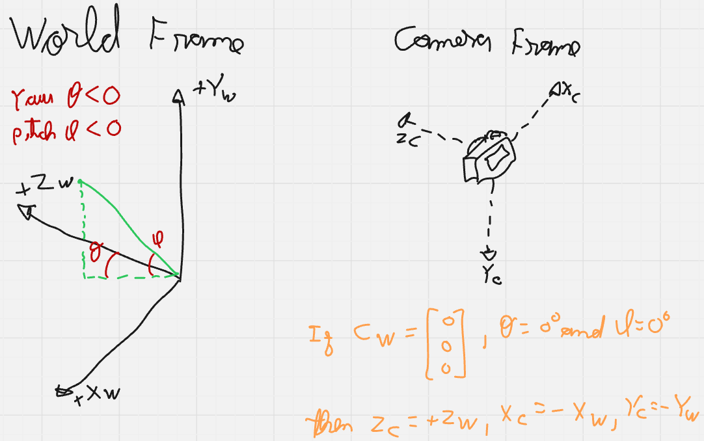
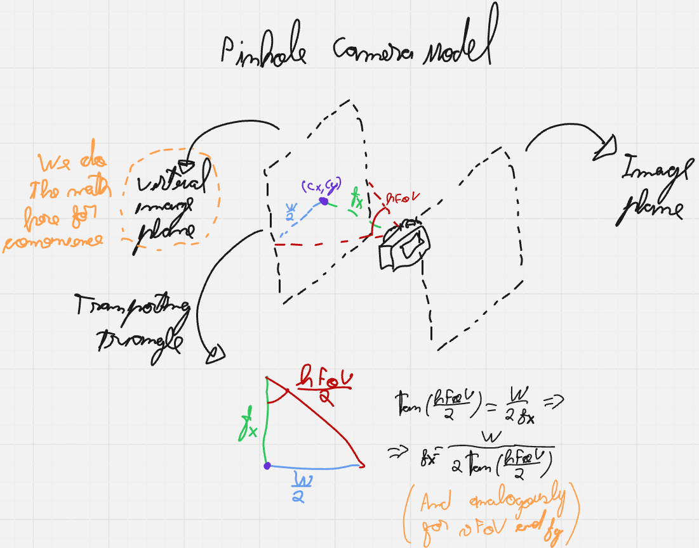
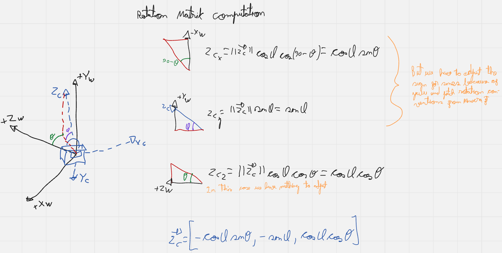
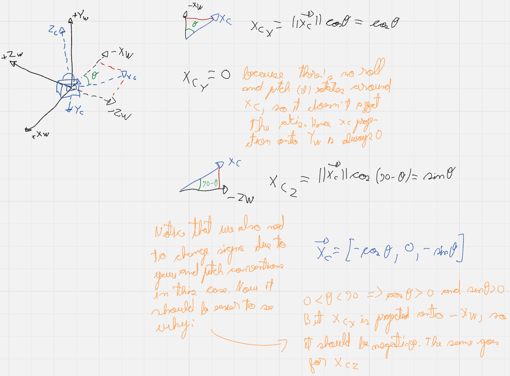

# Structure from Motion Pipeline

Structure from Motion (SfM) is a technique for estimating three-dimensional structures from two-dimensional image sequences. In a traditional SfM pipeline, both the camera parameters (extrinsics) and the scene geometry (3D points) are unknown and must be estimated simultaneously. In this specific implementation, we simplify the problem a bit and operate under a definition often referred to as mapping with known poses. We utilize a synthetic Minecraft dataset generated via [Project Malmo](https://github.com/microsoft/malmo), which provides ground-truth poses for the camera. Consequently, our pipeline bypasses the "motion" estimation phase and focuses on the "structure" aspect: triangulation of features based on known projection matricesThe Pipeline Goal

- Ingest a sequence of RGB images and their corresponding pose tuple ($X, Y, Z, \text{yaw}, \text{pitch}$).

- Convert them into camera matrices, a mathematically rigorous linear algebra framework.

- Detect and track features across multiple views.

- Triangulate these features into a 3D point cloud.

- Refine the structure via bundle adjustment to minimize reprojection error and get to a less noisy point-cloud.

## Camera Matrices

Because our data originates from a game engine (Minecraft) and is processed in a computer vision library ([OpenCV](https://opencv.org/)), we must define a rigorous transformation between these two worlds.

### Dataset and Input Space 
Our dataset provides the classic rigid body 6-DoF pose of the agent (camera) for every frame $i$, though our specific input data is constrained to 5-DoF  because roll is always 0:

- Position of the camera in world coordinates: $\mathbf{C}_w = [X, Y, Z]^T$.

- Orientation fo the camera in world frame: Euler angles $\theta_{yaw}$ and $\phi_{pitch}$ in degrees (there's no roll in Minecraft).

And from the game information, we know that the Minecraft world frame ($\mathcal{F}_W$) is: 

- $+\mathbf{X}_W$: East.

- $+\mathbf{Y}_W$: Up.

- $+\mathbf{Z}_W$: South.

- Yaw: $0^\circ \rightarrow +Z_W$ and $-90^\circ \rightarrow +X_W$.

- Pitch: $-90^\circ \rightarrow +Y_W$ and $+90^\circ \rightarrow -Y_W$.

We should also consider the camera frame ($\mathcal{F}_C$):

- $+\mathbf{X}_C$: Pointing right.

- $+\mathbf{Y}_C$: Pointing down.

- $+\mathbf{Z}_C$: Pointing forward (the optical axis).

     
    

    Illustration of world and camera frames for better understanding.
     

### Target Space: Pinhole Camera Model

We utilize the standard Pinhole Camera Model. This requires us to construct a projection matrix $\mathbf{P}$ that maps a 3D point in the world $\mathbf{X}_w$ to a 2D pixel coordinate $\mathbf{x}$. Mathematically:

$$\mathbf{x} \approx \mathbf{P} \mathbf{X}_w$$
$$\mathbf{P} = \mathbf{K} [\mathbf{R} | \mathbf{t}]$$

Where:

- $\mathbf{K}$ is the intrinsics matrix (internal camera properties).

- $\mathbf{R}$ is the rotation matrix (mapping world axes to camera axes).

- $\mathbf{t}$ is the translation vector (position of the world origin relative to the camera).

#### Intrinsics K

Now we have to construct all of these mathematical objects, starting with the intrinsics. It projects 3D camera coordinates onto the 2D image plane and, assuming we have no skew, it's given by:

$$\mathbf{K} =
\begin{bmatrix} 
    f_x & 0 & c_x \\
    0 & f_y & c_y \\
    0 & 0 & 1
\end{bmatrix}$$

Given an image resolution $W \times H$ and a horizontal field of View ($FoV_h$), selected by the player inside the the game, the horizontal focal length $f_x$ is derived as:

$$f_x = \frac{W}{2 \cdot \tan(FoV_h / 2)}$$

     
    

    Illustration of pinhole camera model to make computations clearer.
      

A point that of common struggle is understanding the meaning of $f_x$ and $f_y$, after all $f$ is just a distance along the Z-axis, so it shouldn't have an horizontal and vertical components. These numbers encode, in reality, the same distance $f$, only measured with pixel width units for $f_x$ and pixel height units for $f_y$. This also explains the next fact we are going to use: by design, Minecraft has square pixels, which implies that our pixel units are the same, thus $f_y = f_x$. Additionaly, by the fact that this is a simulation, we also have a centralized principal point, which means:

$$c_x = \frac{W}{2}, \quad c_y = \frac{H}{2}$$

#### Rotation Matrix R

So we now know how to compute intrinsics perfectly, we can start constructing extrinsics. We cannot simply convert Minecraft Euler angles to a rotation matrix directly because of the zero mismatch. Standard Euler matrices assumes that, at angle 0, the object is perfectly aligned with the world, which is not the case of our camera (check the world and camera frames image again).

Instead, we construct the rotation matrix $\mathbf{R}$ column-by-column (or row-by-row) by calculating the Basis Vectors of the camera frame expressed in world coordinates. For that, we'll make use of spherical coordinates using Minecraft definitions of yaw and pitchThe forward vector ($\mathbf{f}$) corresponds to the camera's Z-axis ($+\mathbf{Z}_C$):

$$f_x = - \cos(\phi_{pitch}) \sin(\theta_{yaw})$$

$$f_y = -\sin(\phi_{pitch})$$

$$f_z = \cos(\phi_{pitch}) \cos(\theta_{yaw})$$

Note that the signs had to be adjusted for sines in $X$ and $Y$ coordinates because of yaw and pitch rotation conventions from Minecraft. This will eventually be the case for the next vector too.

The right vector ($\mathbf{r}$) corresponds to the camera's X-axis ($+\mathbf{X}_C$):

$$r_x = -\cos(\theta_{yaw})$$

$$r_y = 0$$

$$r_z = -\sin(\theta_{yaw})$$

- The down vector ($\mathbf{d}$) corresponds to the Camera's Y-axis ($+\mathbf{Y}_C$). Since our basis vectors must be orthogonal, the down vector is simply the cross product of the previous vectors. Choosing the order depends on where we want it to point at and, in our case, the answer is down ($-\mathbf{Y}_W$), so we use forward then right:

$$\mathbf{d} = \mathbf{f} \times \mathbf{r}$$

This comes from [OpenCV](https://opencv.org/), where $\mathbf{X} \times \mathbf{Z} = -\mathbf{Y}$ (with $+\mathbf{Y}$ pointing down by convention), so we do the opposite order.

     
    

    Geometric illustration of the camera Z vector getting computed in terms of the world frame to clarify how to get to the above expressions.
      

     
    

    Geometric illustration of the camera X vector getting computed in terms of the world frame to clarify how to get to the above expressions.
      

Now we can get back to the rotation matrix, which rotates a vector from world frame to camera frame. Rows are simply these normalized and transposed (because the matrix will be left multiplying) basis vectors. Since we want the typical $(X, Y, Z)$ coordinates, we'll stack the matrix with $\mathbf{r}$ then $\mathbf{d}$ then $\mathbf{f}$:

$$\mathbf{R} =
\begin{bmatrix}
\rule[2pt]{10pt}{0.5pt} & \mathbf{r}^T & \rule[2pt]{10pt}{0.5pt} \\
\rule[2pt]{10pt}{0.5pt} & \mathbf{d}^T & \rule[2pt]{10pt}{0.5pt} \\
\rule[2pt]{10pt}{0.5pt} & \mathbf{f}^T & \rule[2pt]{10pt}{0.5pt} 
\end{bmatrix}$$

#### Translation Vector t

And finally getting to the translation vector $\mathbf{t}$, it represents the position of the world origin as seen from the camera frame. Intuitively it's what makes the camera the origin of its own frame. To compute it, we do:
 
$$\mathbf{R} \cdot \mathbf{C}_w + \mathbf{t} = \mathbf{0} \implies$$

$$\implies \mathbf{t} = -\mathbf{R} \cdot \mathbf{C}_w$$

## Feature Extraction and Tracking

Now that we know how to map points in the world to pixels in our images, we move on to the next part: feature extraction and tracking. This chapter documents how we identify specific points in the 3D world from the 2D images (feature extraction) and how we determine that a point in image A is the same physical object as a point in image B (matching and tracking).

### Feature Extraction

We implemented our code with two possible (open-source) feature extractors so we could compare methods. We now introduce them here:

#### Scale-Invariant Feature Transform (SIFT)

To reconstruct the 3D structure, we first need to identify "interesting" points in our 2D images that are invariant to scale, rotation, and illumination changes. We utilize the Scale-Invariant Feature Transform (SIFT).

For an image $I$, SIFT identifies keypoints $\mathbf{x} = (u, v)$ and computes a descriptor vector $\mathbf{d} \in \mathbb{R}^{128}$ for each. These are the multiple steps to get there:

- Scale-Space Construction: The image is convolved with Gaussian filters at different scales to get different zoom perceptions of the image. Then Differences of Gaussians (DoG) are computed to find potential keypoints that are stable across different zoom levels.

- Keypoint Localization: Low-contrast points and edge responses are eliminated to leave only strong "corner-like" features. The former are easy to identify (simply extrema detection), but the latter are a bit more tricky.

    First, a DoG function responds strongly to corners and edges, so why do we remove edges? Edges are bad for tracking because of the aperture problem. Check [this very cool website](https://elvers.us/perception/aperture/) for more details, but basically it states that the local motion information is inherently ambiguous with respect to the global motion for a straight line seen through a small aperture. That is, many different motions could cause the same response visual response for a small receptive field.

    So back to removing edges, SIFT calculates the Hessian Matrix $\mathbf{H}$ at the keypoint location:
    
    $$\mathbf{H} =
    \begin{bmatrix}
    D_{xx} & D_{xy} \\
    D_{xy} & D_{yy}
    \end{bmatrix}$$
    
    We then check the ratio of eigenvalues of $\mathbf{H}$. If the ratio is high (one eigenvalue is much bigger than the other), it indicates an edge and we can discard these keypoints. We only keep points where curvature is high (two big and relatively similar eigenvalues) in both directions, which indicates a corner.

- Orientation Assignment: To make the descriptor rotation-invariant, we must assign a dominant direction to the keypoint so we can rotate the world to match it later.

    For that, we take a window around the keypoint depending on the scale $\sigma$. We then compute the gradient magnitude $m(x,y)$ and orientation $\theta(x,y)$ for every pixel in that window and we build a 36-bin histogram (covering 360 degrees in 10 degrees steps). Pixels closer to the center matter more, so we weight the magnitude contributions by a Gaussian window.
    
    Sometimes a corner is ambiguous, so if the histogram has a secondary peak that is within 80% of the main peak's height, SIFT creates two separate keypoints at the exact same location $(x,y)$, but with different orientations. This allows the algorithm to try matching both versions.

- Keypoint Descriptor: A $16 \times 16$ neighborhood around the keypoint is taken. It is divided into $16$ sub-blocks of $4 \times 4$ size. For each sub-block, an 8-bin orientation histogram is created, which leads to a $4 \times 4 \times 8 = 128$ element feature vector.This vector $\mathbf{d}$ is the "fingerprint" of that visual feature.

    Notice that there's a difference between the general orientation and the descriptor. The keypoint orientation is the reference frame whereas the descriptor bins are the data. Suppose you didn't do the former. If you took a photo a same intersection for which you already computed SIFT features while hanging upside down, the descriptor would change (also be upside down), and we wouldn't match keypoints that were supposed to be matches.

#### Oriented FAST and Rotated BRIEF (ORB)

